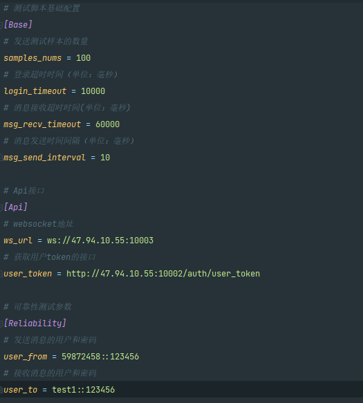
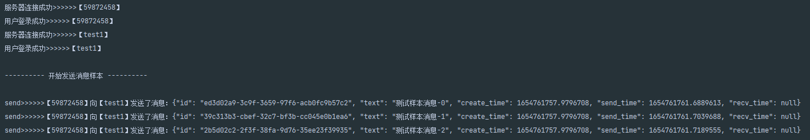
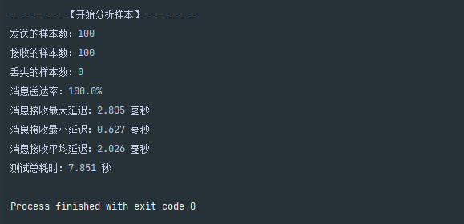

# IM即时通讯Python测试脚本说明
当前测试脚本针对OpenIM即使通讯进行编写，其他平台测试需进行针对性适配调试

## 一、脚本执行流程
1. 读取配置文件信息，创建发送用户和接收用户客户端
2. 发送http请求获取用户token
3. 用户客户端连接IM服务并调用登录请求
4. 根据配置文件生成固定数量消息测试样本数据
5. 发送样本数据
6. 接收样本数据
7. 分析接收到的样本数据
8. 输出分析结果
## 二、脚本参数配置
配置文件名称为config.ini

###### 基础配置 [Base] 
`samples_nums` 发送测试样本的数量
> __例：__ samples_nums = 100

`login_timeout` 用户登录到服务器的超时时间（单位：毫秒）
> __例：__ login_timeout = 10000

`msg_recv_timeout` 消息样本接收超时时间(单位：毫秒)
> __例：__ msg_recv_timeout = 60000

`msg_send_interval` 消息样本发送时间间隔（单位：毫秒）
> __例：__ msg_send_interval = 10

###### Api接口 [Api]
`ws_url` IM服务的websocket地址
> __例：__ ws_url = ws://47.94.10.55:10003

`user_token` 获取用户token的接口
> __例：__ user_token =http://47.94.10.55:10002/auth/user_token

###### 可靠性测试参数 [Reliability] 
`user_from` 发送消息的用户和密码, `::` 符号左边为用户名，右边为密码
>当前脚本中对该配置项值进行了格式解析，但密码未使用到，因OpenIM的获取用户token的接口可直接通过用户名获取

> __例：__ user_from = test1::123456

`user_to` 接收消息的用户和密码
> __例：__ user_to = test2::123456

## 三、执行脚本
```shell
python main.py
```


## 四、输出结果

